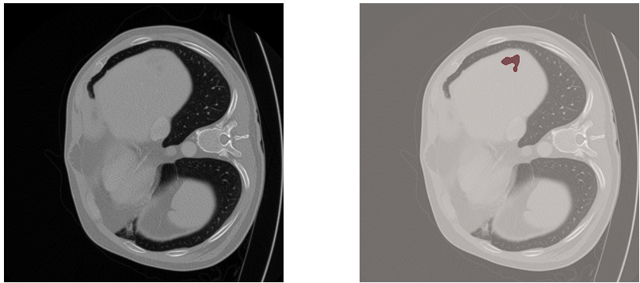
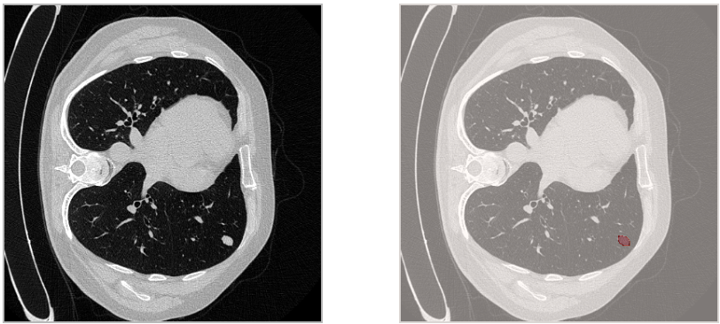

# Liver & Lung Tumor Segmentation with Synthetic Data
Project *"Liver & Lung Tumor Segmentation with Synthetic Data"* for the **2024/2025 Neural Networks course**.

This repository reimplements and extends the method proposed by [Hu et al., *Label-Free Liver Tumor Segmentation*, CVPR 2023](https://openaccess.thecvf.com/content/CVPR2023/papers/Hu_Label-Free_Liver_Tumor_Segmentation_CVPR_2023_paper.pdf).  
Manual annotation of tumors is costly and limited by the scarcity of available data. To address this issue, we investigated the use of automatically generated synthetic tumors as an alternative to manual annotations for training segmentation models (e.g., U-Net). After validating the approach on liver CT scans, we extended the pipeline to lung CT data, assessing whether automatic generation can yield comparable or even improved performance.


## Overview

- Synthetic liver tumor generation



- Synthetic lung nodule generation



---

## Datasets & weights

We used two different datasets in our experiments:

- **Liver tumor generation**  
  For the liver experiments we strictly followed the instructions provided in the official repository of the paper: [Hu et al. – Label-Free Liver Tumor Segmentation (official repo)](https://github.com/MrGiovanni/SyntheticTumors/blob/main/INSTALL.md)

- **Lung nodule generation**  
  For the lung experiments we used the [LNDb dataset](https://doi.org/10.48550/arXiv.1911.08434), which contains **294 annotated CT scans** collected at the Centro Hospitalar e Universitário de São João (Porto, Portugal) between 2016 and 2018.  

You can download processed versions of the datasets, the JSON files and the models weights here: [Download](https://drive.google.com/drive/folders/1POFiiJLGIbaSIW0irq1wYjAQ-cH3PNQG?usp=drive_link)


---
## Results

### Liver Experiments

| Model             | DSC (Tumor) | DSC (Liver)  | Total mean DSC  |
|-------------------|--------------|-------------|-----------------|
| U-Net (Synthetic) |     31.06%   |  84.13%     | 57.60%          |

### Lung Experiments

| Model             | DSC (Nodule) | DSC (Lungs)  | Total mean DSC  |
|-------------------|--------------|--------------|-----------------|
| U-Net (Synthetic) |     22.41%   |  96.62%      | 59.51%          |


## Conclusions
- Synthetic tumors are competitive with real annotations, showing potential for label-free segmentation.
- Transferring the method from liver to lung is feasible, though more challenging due to anatomy and intensity differences.

- Future work: improve realism of synthetic lesions using generative models.

---

## Requirements

To reproduce the experiments, the following minimum hardware requirements are recommended:

* Liver experiments: at least 16 GB RAM
* Lung experiments: at least 32 GB RAM

## Repository Structure

```plaintext

├── FINAL_NOTEBOOK.ipynb         # Main Jupyter Notebook with full pipeline
├── assets                       # Images used for README.md
  ├── liver_tumor.png            # Image of a synthetic liver tumor
  └── lung_nodule.png            # Image of a synthetic lung nodule
├── LungNodule_Generation.ipynb  # Lung nodule notebook for reproducibility
├── LiverTumor_Generation.ipynb  # Liver tumor notebook for reproducibility
├── presentation.pdf             # Project slides 
└── README.md                    # Project documentation
```
---
## Authors
- [A. Infantino 1922069](https://github.com/alessiainf)
- [A. Di Chiara 1938462](https://github.com/AlessandroDiChiara)
- [F. Fragale 2169937](https://github.com/Bannfrost99)


## Acknowledgments
- We thank Hu et al. for their work on label-free liver tumor segmentation.
- We acknowledge the authors of the LNDb dataset and other public medical datasets.
- Frameworks used: PyTorch, MONAI.


